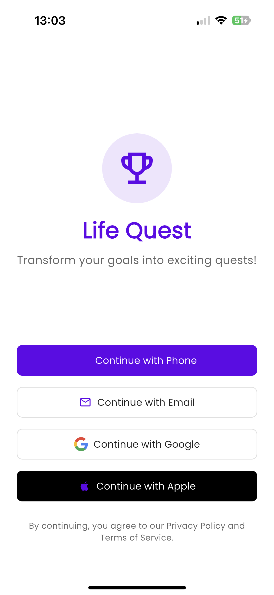
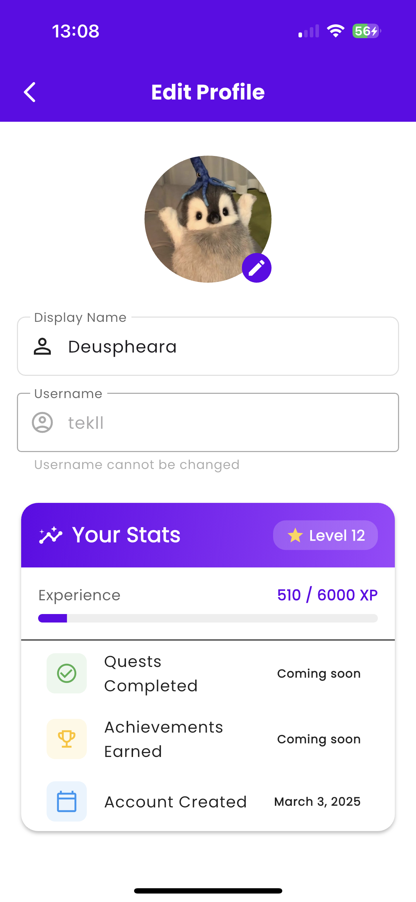
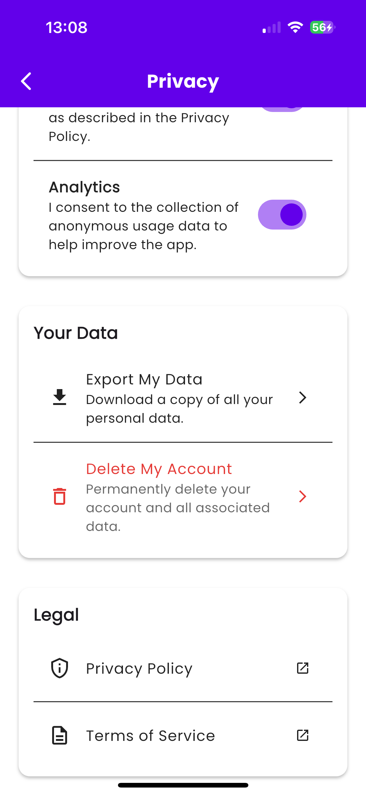
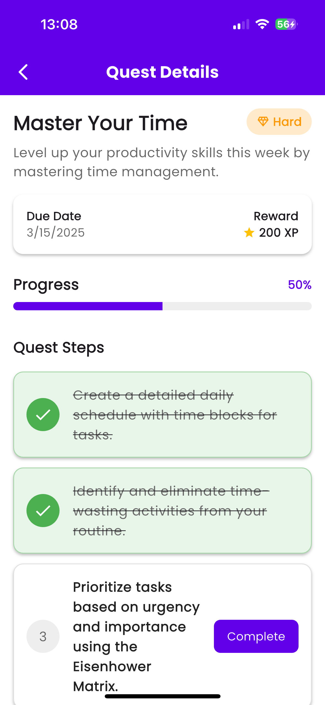
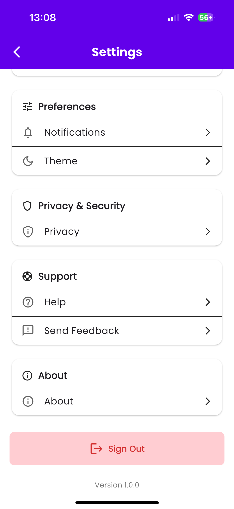
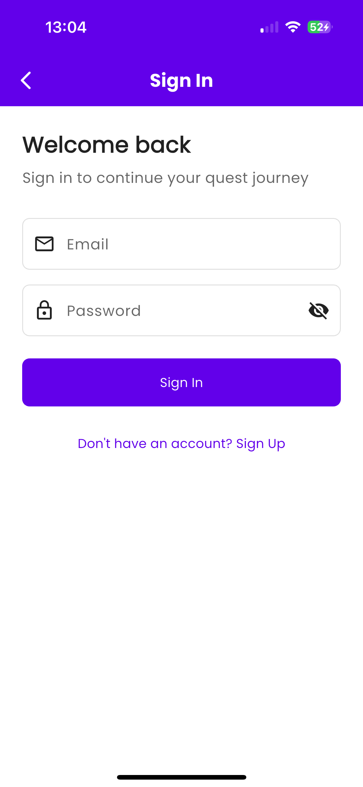
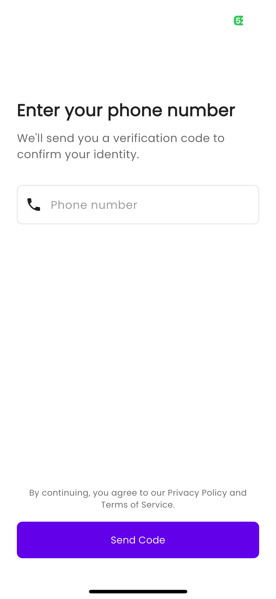

# Life Quest - Gamified Goal Tracking App

A Flutter app with Supabase backend that helps users achieve life goals through gamification.

## App Screenshots

| Authentication | User Profile | Privacy Settings | Quest Details |
|:--------------:|:------------:|:----------------:|:-------------:|
|  |  |  |  |
| **Settings** | **Sign In** | **Phone Verification** | **App Icon** |
|  |  |  |  |

## Features

### Authentication and User Management
- Phone number verification through Supabase
- Basic profile creation (username, display name)
- Secure session management
- Future payment integration via Stripe (not implemented in initial version)

### Core Functionality
- Gamified user experience similar to Duolingo with levels, achievements, and unlockable content
- Cloud functions that query user interests and generate personalized AI quests
- Quest/task management system with completion tracking
- Progress visualization and rewards

### Design and UX
- Clean, simple, gamified interface with engaging animations
- Customizable avatars and visual rewards
- Intuitive navigation and user flows
- Achievement badges and level-up celebrations

### Technical Features
- Supabase for backend (authentication, database, cloud functions)
- PostHog for open-source analytics solution
- Basic security implementation focusing on data protection
- Proper error handling and offline functionality

### GDPR Compliance
- Multi-step onboarding with clear explanation of data usage
- Minimal data collection (only username/name initially)
- Transparent privacy policy written in plain language
- Explicit consent mechanisms with opt-out options
- User data control (export, modify, delete options)

## Project Setup

### Prerequisites
- Flutter SDK (2.10.0 or newer)
- Dart SDK (2.16.0 or newer)
- Supabase account
- PostHog account (or other analytics provider)

### Getting Started

1. Clone the repository:
```bash
git clone https://github.com/deuspheara/life_quest.git
cd life_quest
```

2. Install dependencies:
```bash
flutter pub get
```

3. Configure Supabase:
    - Create a new Supabase project
    - Run the SQL schema in `database/supabase-schema.sql` to set up the database
    - Deploy the Edge Function in `supabase/functions/generate-quest`
    - Enable phone authentication in the Supabase Auth settings
    - Create storage buckets for user avatars and other assets

4. Set up environment variables:
    - Create a `.env` file in the project root (or use your preferred method)
    - Add your Supabase URL and anon key:
      ```
      SUPABASE_URL=your_supabase_url
      SUPABASE_ANON_KEY=your_supabase_anon_key
      POSTHOG_API_KEY=your_posthog_api_key
      ```

5. Configure PostHog:
    - Set up a PostHog account
    - Create a new project
    - Add the API key to your environment variables

6. Run the app:
```bash
flutter run
```

## Project Structure

```
lib/
├── constants/          # App-wide constants like colors, strings
├── models/             # Data models
├── services/           # Service classes for API calls, authentication, etc.
├── utils/              # Utility functions and helpers
├── views/              # UI screens and widgets
│   ├── achievements/   # Achievement-related screens
│   ├── auth/           # Authentication screens
│   ├── home/           # Main app screens
│   ├── quests/         # Quest-related screens
│   ├── settings/       # Settings and profile screens
│   └── widgets/        # Reusable UI components
├── main.dart           # App entry point
└── app.dart            # Main app configuration
```

## Future Enhancements

- Stripe integration for premium features
- Social features like leaderboards or challenges
- More complex AI-driven quest generation
- Additional customization options for avatars and themes
- Push notifications for quest reminders and achievements

## Contributing

1. Fork the repository
2. Create your feature branch (`git checkout -b feature/amazing-feature`)
3. Commit your changes (`git commit -m 'Add some amazing feature'`)
4. Push to the branch (`git push origin feature/amazing-feature`)
5. Open a Pull Request